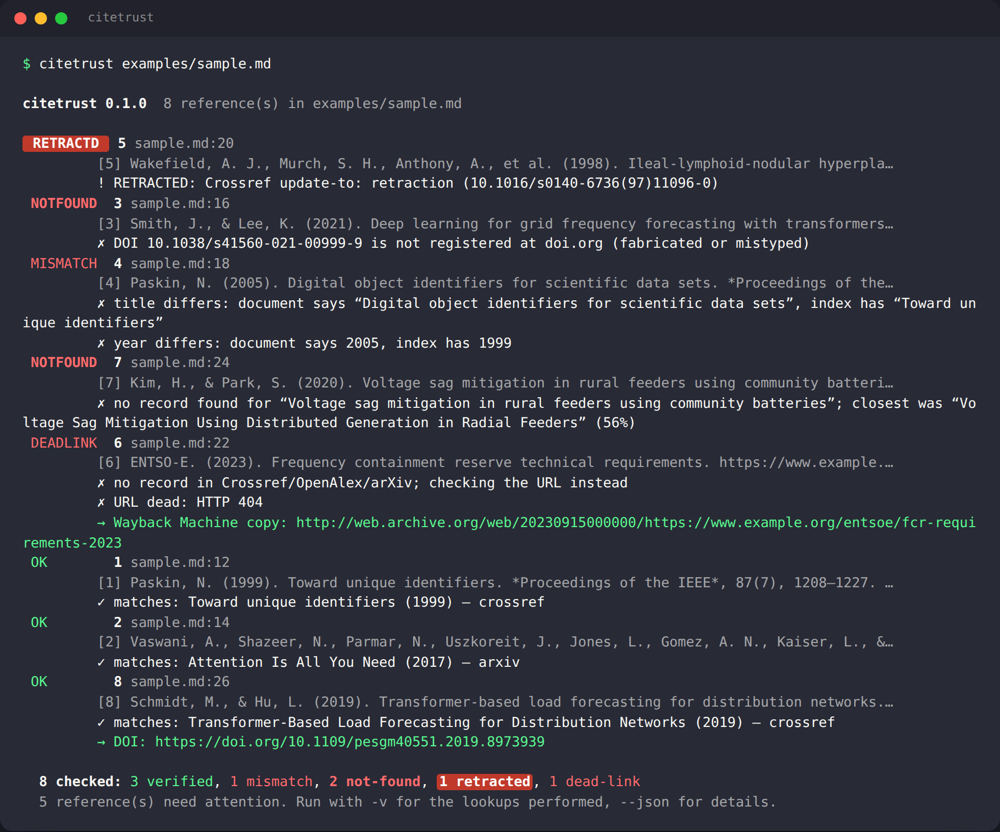

# citetrust

**Check that the references in a document actually exist, say what the document claims they say, and haven't been retracted.**

[](https://github.com/kosys0224-spec/citetrust/actions/workflows/ci.yml)
[](https://www.python.org/)
[](pyproject.toml)
[](LICENSE)

```bash
pipx install git+https://github.com/kosys0224-spec/citetrust
citetrust paper.md          # also: thesis.docx, refs.bib, chapter.tex, post.html, notes.txt, a whole directory
```



Reads **Markdown, plain text, reST, LaTeX, HTML, DOCX and BibTeX**, finds the bibliography (or inline DOIs / arXiv ids / PMIDs / URLs), and asks the public indexes — **Crossref, OpenAlex, arXiv, PubMed, doi.org** — whether each reference is real. Then it compares what the document *claims* (title, first author, year) with what the index *has*, flags retractions, and checks that cited URLs are alive (suggesting a Wayback Machine copy when they are not). No account, no API key, no dependencies.

## Why

AI writing assistants produce three kinds of bad references, and the dangerous ones are not the obvious ones:

| Kind | Example | Caught by a DOI resolver? |
|---|---|---|
| Fully fabricated | made-up title, made-up journal, no identifier | no (nothing to resolve) |
| Fabricated identifier | plausible-looking DOI that is not registered | yes |
| **Real identifier, wrong claim** | real DOI, but the title/authors/year attached to it belong to a different paper | **no** — the DOI resolves fine |

Add two human classics — citing a paper that was retracted years ago, and a URL that now 404s — and you have the checklist a reviewer, editor, teaching assistant or careful author goes through by hand. citetrust does it in one command and works on the document itself, not only on a `.bib` file.

## What it checks

- **Existence** — DOI registered at doi.org; record in Crossref (then OpenAlex for DataCite/Zenodo-style DOIs); arXiv id exists; PMID exists; free-text entries are searched in Crossref → OpenAlex → arXiv by title.
- **Agreement** — title similarity (normalised, punctuation/stop-word insensitive), first-author family name, year (±1 tolerated for online-vs-print). Disagreement on a resolving identifier is reported as **MISMATCH** with both versions side by side.
- **Retractions** — Crossref `update-to` retraction notices, OpenAlex `is_retracted`, PubMed "Retracted Publication", and titles that begin with RETRACTED.
- **Links** — HEAD/GET with soft-404 and redirect-to-homepage detection; dead links get a Wayback Machine snapshot suggestion.
- **Missing DOIs** — when a free-text reference matches a Crossref record, the DOI is suggested so you can add it.

Statuses: `verified`, `likely` (close match, look at it), `mismatch`, `not-found`, `retracted`, `dead-link`, `unreachable` (network/403 — unknown, not an accusation), `skipped`.

## Quick start

```bash
pipx install git+https://github.com/kosys0224-spec/citetrust   # or pip install git+…
citetrust examples/sample.md                                     # the document in the screenshot
citetrust thesis.docx --only-problems                            # just the bad ones
citetrust refs.bib --json > report.json
citetrust docs/ --markdown                                       # table for a PR comment
citetrust paper.md --list                                        # what would be checked, no network
cat pasted-references.txt | citetrust -
```

Give Crossref and OpenAlex an email (`--mailto you@example.org` or `CITETRUST_MAILTO`) to be routed to their faster "polite" pools. Lookups are cached for 7 days in `~/.cache/citetrust`, so re-running after an edit only checks what changed.

Exit codes: `0` nothing at or above `--fail-on` (default `mismatch`, i.e. mismatch/not-found/retracted), `1` problems found, `2` error — so it works as a CI gate.

## Example

`examples/sample.md` is a short draft with eight references. citetrust reports:

```text
 RETRACTD  5 sample.md:20   ! RETRACTED: Crossref update-to: retraction
 NOTFOUND  3 sample.md:16   ✗ DOI 10.1038/s41560-021-00999-9 is not registered at doi.org (fabricated or mistyped)
 MISMATCH  4 sample.md:18   ✗ title differs: document says “Digital object identifiers for scientific data sets”,
                              index has “Toward unique identifiers”   ✗ year differs: 2005 vs 1999
 NOTFOUND  7 sample.md:24   ✗ no record found for “Voltage sag mitigation in rural feeders using community batteries”
 DEADLINK  6 sample.md:22   ✗ URL dead: HTTP 404  → Wayback Machine copy: http://web.archive.org/web/2023…
 OK        1 sample.md:12   ✓ matches: Toward unique identifiers (1999) — crossref
 OK        2 sample.md:14   ✓ matches: Attention Is All You Need (2017) — arxiv
 OK        8 sample.md:26   ✓ matches: Transformer-Based Load Forecasting … (2019) — crossref  → DOI: https://doi.org/10.1109/pesgm40551.2019.8973939
```

Reference 4 is the case that matters: a real DOI with a different paper's title and year attached — exactly what a language model produces when it "remembers" a citation.

## How references are found

1. A heading named References / Bibliography / Works Cited / 참고문헌 / 参考文献 / Literatur / Références… starts a bibliography block; entries are split on blank lines or on `[n]`, `n.`, `n)`, bullets, and may wrap across lines.
2. Without a heading, any line that looks like an entry (author-year pattern, `[n]` label, DOI or arXiv id) is taken.
3. DOIs, arXiv ids, PMIDs and URLs anywhere else in the text are checked individually.
4. Each entry is parsed into *title / family names / year / venue*: quoted titles win; in APA-style entries the first sentence after the year is the title and the italicised span is the venue; BibTeX and `\bibitem` fields are read directly.
5. DOCX: `word/document.xml`, footnotes and endnotes are read paragraph by paragraph; hyperlink targets are included.

Parsing is heuristic. When it gets a title wrong you will usually see a `likely` or a low-percentage "closest record" line rather than a false `not-found`; `--list` shows exactly what was extracted so you can fix the entry format.

## Output formats

| Flag | Output |
|---|---|
| (default) | colour text report, sorted worst-first; `--only-problems` hides verified entries; `-v` shows which indexes were queried |
| `--json` | everything: parsed reference, matched record, similarity score, suggestions |
| `--markdown` | a table, ready for a pull-request comment |
| `--sarif` | SARIF 2.1.0 with file:line, for GitHub code scanning |

## CI

```yaml
- uses: actions/checkout@v4
- run: pipx install git+https://github.com/kosys0224-spec/citetrust
- run: citetrust docs/ --sarif --fail-on never > citetrust.sarif
- uses: github/codeql-action/upload-sarif@v3
  with: { sarif_file: citetrust.sarif }
```

Or simply `citetrust docs/ --fail-on not-found` to block a merge only on fabricated references and retractions.

## Limits (read before trusting a red line)

- `not-found` means *not in Crossref, OpenAlex or arXiv*. Books, standards, reports, theses, legal citations and many non-English or pre-1990 works are not there. For those, citetrust can only check a DOI or URL if the entry has one.
- `unreachable` is not a verdict. Publisher sites block automated HEAD requests (403), APIs rate-limit; re-run later or check by hand.
- Title matching is tolerant (85 % similarity) so subtitle/punctuation differences pass; it will not catch a reference that cites the right paper for the wrong claim. That needs a reader.
- Retraction data depends on the indexes carrying the notice; absence of a flag is not proof of good standing.

## Roadmap

- [ ] PyPI release
- [ ] Retraction Watch database as a second retraction source
- [ ] PDF input (reference section extraction)
- [ ] Zotero/CSL-JSON input and output
- [ ] `--fix` mode: rewrite entries with the DOI/title the index has (interactive)
- [ ] Non-Latin author-name matching (Korean/Chinese/Japanese family names are currently compared as given)
- [ ] pre-commit hook definition

## Contributing

New input formats, better entry parsers for citation styles that confuse the heuristics, and recorded-fixture tests for more index corner cases are all welcome — see [CONTRIBUTING.md](CONTRIBUTING.md). Tests run fully offline: `python -m unittest discover -s tests -v`.

## Data sources

Crossref REST API, OpenAlex API, arXiv API, NCBI E-utilities (PubMed), doi.org handle API, Internet Archive availability API. Please respect their terms: set `--mailto`, keep `--workers` modest, and do not hammer them in tight loops (the cache helps).

## License

[MIT](LICENSE) © 2026 Inhyeok Park
